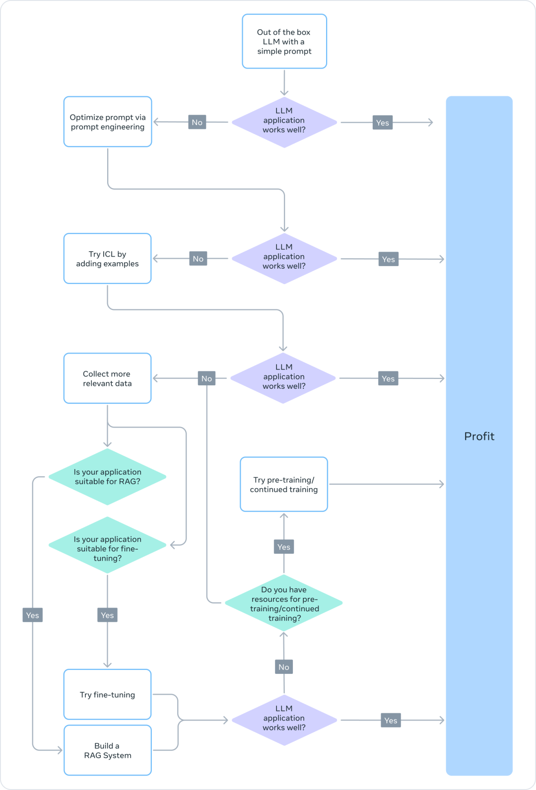

# Meta Llama微调指南
## 01_适配大模型
### 预训练
- 预训练是指，使用数万亿个token数据，从头开始训练LLM的过程，通常使用自监督算法进行训练。
- 最常见的情况是，训练通过自回归预测下一个token（也称为因果语言建模）。
- 预训练通常需要数千个GPU小时（105-107个），并分布在多个GPU上进行。
- 预训练的输出模型称为「基础模型」。
### 继续预训练
- 继续预训练（也称为第二阶段预训练）将使用全新的、未见过的领域数据进一步训练基础模型。
- 同样使用与初始预训练相同的自监督算法。通常会涉及所有模型权重，并将一部分原始数据与新数据混合。
### 微调
- 微调是以监督方式使用带注释的数据，或使用基于强化学习的技术，来适配预训练语言模型的过程。
- 与预训练相比，微调有两个主要区别：
    - 在包含正确标签/答案/偏好的注释数据集上进行监督训练，而不是自监督训练
    - 需要较少的token（数千或数百万，而不是预训练中需要的数十亿或数万亿），其主要目的是提高能力，如指令遵循、人类对齐、任务执行等。
- 要了解微调的现状，可以从两个方面入手：
    - 参数变化的百分比
    - 微调后新增的能力
### 更改的参数百分比
- 根据更改的参数量，有两类算法：
    - 全面微调：顾名思义，这包括更改模型的所有参数，包括在XLMR和BERT（100-300M参数）等小模型上所做的传统微调，以及对Llama 2、GPT3（1B+参数）等大模型上的微调。
    - 参数高效微调（PEFT）：PEFT算法只微调少量额外参数，或更新预训练参数的子集，通常是总参数的1%-6%，而不是对所有LLM权重进行离线微调。
### 基础模型新增的能力
- 微调的目的是为了向预训练的模型添加功能，比如指令遵循、人类对齐等。- 聊天微调Llama 2，就是一个具有附加指令遵循和对齐能力的微调模型的例子。
### 检索增强生成（RAG）
- 企业还可以通过添加特定领域的知识库来适配LLM，RAG是典型的「搜索驱动的LLM文本生成」。
- RAG于2020年推出，它使用动态提示上下文，通过用户问题检索并注入LLM提示，以引导其使用检索到的内容，而不是预训练的知识。
### 上下文学习（ICL）
- 对于ICL，通过在提示符中放置原型示例来适配LLM。多项研究表明，「举一反三」是有效的。这些示例可以包含不同类型的信息：
    - 仅输入和输出文本，也就是少样本学习
    - 推理追踪：添加中间推理步骤，可参阅思维链（COT）提示
    - 计划和反思追踪：添加信息，教LLM计划和反思其解决问题的策略，可参阅ReACT
## 02_选择正确的适配方法
要决定上述哪种方法适合特定应用，应该考虑各种因素：
- 所追求任务所需的模型能力
- 训练成本
- 推理成本
- 数据集类型
等

### 预训练
- 模型预训练需要大量的计算资源，不建议重新预训练，而是在现有预训练模型上更新模型权重
- 任何更新预训练模型权重的方法，都容易出现一种「灾难性遗忘」的现象
### 继续预训练（CPT）
- 相较于预训练，继续预训练需要的计算成本低，但仍然需要大量的数据和计算资源
- 容易导致灾难性遗忘
- 一般不建议做继续预训练
### 全参微调和参数高效微调（PEFT）
- 与使用未注释的数据集进行预训相比，使用较小的带注释的数据集进行微调，是一种更具成本效益的方法。
- 微调，特别是参数高效微调，只需要预训练/继续预训练所需计算资源的一小部分。
### 检索增强生成（RAG）
- 系统复杂主要在于检索
- 推理成本高
### 上下文学习（ICL）
- 随着推理时处理更多的token，推理成本和延迟可能会增加
## 03_微调还是不微调
### 微调可能有益的原型
- 以下场景确定为可从微调中受益的常见用例：
    - 语气、风格、形式定制：使用案例可能会寻求反映特定角色或服务特定受众的LLM。通过使用定制数据集对LLM进行微调，可以塑造聊天机器人的响应，使其更符合受众的特定需求或预期的体验。另外，研究者可能还希望它能以特定的方式组织输出，例如，JSON、YAML或Markdown格式的输出。
    - 提高精度并处理边缘情况：微调可以用于纠正幻觉或错误，这些错误很难通过prompt和上下文学习来纠正。它还可以增强模型执行新技能或任务的能力，这些技能或任务很难在提示中表达。这个过程可以帮助纠正模型没有遵循复杂提示的错误，并提高其产生所需输出的可靠性
- 微调与上下文学习（少样本）
    - 随着示例增多，推理的成本和延迟会增加
    - 需要找到最相关的示例
    - LLM可以吐出提供给它们的知识作为例子
- 微调与RAG
    - 是否需要更新频繁的外部知识
    - 是否对结果的幻觉或错误有更高的容忍度
    - 成本和复杂性
    - 微调需要一个强大的数据收集和数据改进策略
## 04_如何微调
- 全面微调更容易出现
    - 模型崩溃
    - 灾难性遗忘
- 创建高质量数据集的关键原则
    - 数据集管理
    - 数据集质量/数量
    - 数据多样性
    - 基于LLM的数据管道
        - 评估：用高质量数据集训练一个模型，然后用它来标注较大数据集，以筛选出高质量的样例。
        - 生成：用高质量示例来引导大模型，并通过提示生成类似的高质量样例。合成数据集的最佳实践正在逐渐形成。
        - 人机协作：使用大模型生成初始输出集，然后由人类通过编辑或选择偏好来提高质量。
    - 调试数据集
        - 评估数据集中的不良输出：如果模型在某些方面仍然表现不佳，添加直接向模型展示如何正确处理这些方面的训练示例。如果你的模型存在语法、逻辑或风格问题，检查数据是否存在相同的问题。例如，如果模型现在说「我会为你安排这个会议」（实际上它不应该这样做），看看现有的例子是否教导模型说它可以做一些它实际上不能做的新事情。
        - 仔细检查正面/负面类别的平衡：如果数据中60%的助手回应说「我无法回答这个问题」，但在推理时只有5%的回应应该这样说，你可能会得到过多的拒绝回应。
        - 全面性和一致性：确保你的训练示例包含回应所需的所有信息。如果希望模型基于用户的个人特征来赞美用户，而训练示例中包含了助手对前面对话中没有出现的特征的赞美，模型可能会学会虚构信息。确保所有的训练示例，都采用与推理时预期相同的格式，查看训练示例中的一致性和协调性。
